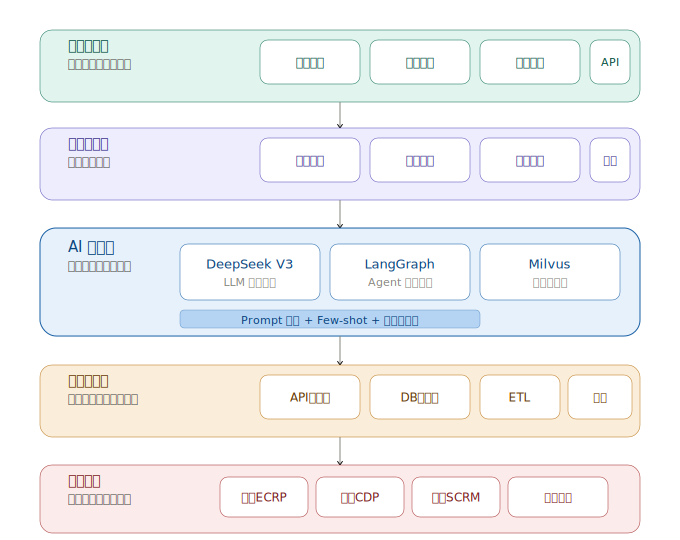
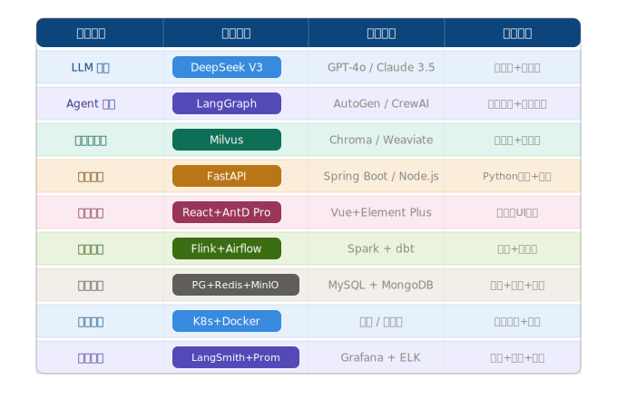

# 🤖 会员运营智能体

> 基于 DeepSeek V4 + LangGraph 的 AI 会员运营助手  
> 自然语言驱动的 CRM Agent，自动识别意图、提取参数、执行分析

---

## 快速启动

### 1. 安装依赖

```bash
# 推荐使用清华镜像（国内更快）
pip install -i https://pypi.tuna.tsinghua.edu.cn/simple \
  fastapi uvicorn langgraph langchain langchain-openai \
  streamlit chromadb pandas scikit-learn pydantic \
  python-dotenv sse-starlette httpx plotly
```

### 2. 配置 DeepSeek API Key

```bash
cp .env.example .env
# 编辑 .env，填入你的 API Key
```

### 3. 生成 Mock 数据

```bash
python src/data/generator.py
```

### 4. 启动

```bash
# 终端 1：后端
PYTHONPATH=src python src/backend/main.py

# 终端 2：前端
PYTHONPATH=src streamlit run src/frontend/app.py
```

浏览器打开 `http://localhost:8501` 即可使用。

---

## 核心场景

### 📊 会员分层策略
```
"帮我给百丽品牌做会员分层，分析近90天数据"
```
→ K-Means 聚类 6 层 + DeepSeek 生成差异化运营策略

### ✍️ 个性化文案生成
```
"给高价值活跃会员生成促活文案，品牌调性要高端轻奢感"
```
→ Few-shot + 向量检索历史文案 → 3 版变体 + 转化率预测

### 📈 活动效果预测
```
"预测满399减60的活动效果，目标高价值会员，企微触达，周期7天"
```
→ 双路检索历史活动 → 6 项 KPI 预测 + 行业基准对比 + 风险预警

---

## 技术栈

| 层级 | 技术 |
|------|------|
| LLM | DeepSeek V3 |
| Agent 框架 | LangGraph (StateGraph + 条件路由) |
| 后端 | FastAPI + SSE 流式 |
| 前端 | Streamlit + Plotly |
| 机器学习 | scikit-learn (K-Means) + pandas (RFM) |
| 数据 | Mock JSON (2000会员 + 3品牌 + 50活动) |

---

## 系统架构



---

## 技术选型



---

## 项目结构

```
会员运营智能体项目/
├── src/
│   ├── frontend/app.py          # Streamlit 聊天界面
│   ├── backend/main.py          # FastAPI + SSE
│   ├── agent/
│   │   ├── graph.py             # LangGraph 工作流
│   │   ├── state.py             # AgentState 定义
│   │   ├── tools/               # 3 个业务工具
│   │   └── prompts/             # Prompt 模板
│   └── data/                    # Mock 数据
├── 原型设计/                    # 交互原型
├── 开发计划.md                  # 任务看板
└── 会员运营智能体项目技术方案_v1.md
```

---

## API 文档

### `GET /api/health`
健康检查，返回版本和 LangGraph 节点列表。

### `POST /api/agent/chat`
Agent 对话入口（SSE 流式）

**请求体：**
```json
{
  "message": "帮我给百丽做会员分层",
  "stream": true
}
```

**SSE 事件流：**
```
event: step    → 执行步骤进度
event: result  → 最终结果 JSON
event: done    → 完成
```

---

## 部署说明

- MVP 阶段本地运行（`python` + `streamlit`）
- 生产部署建议：Docker + Nginx 反向代理 + 替换 Mock 数据为真实数据源
- DeepSeek API Key 通过 `.env` 管理，不硬编码

---
